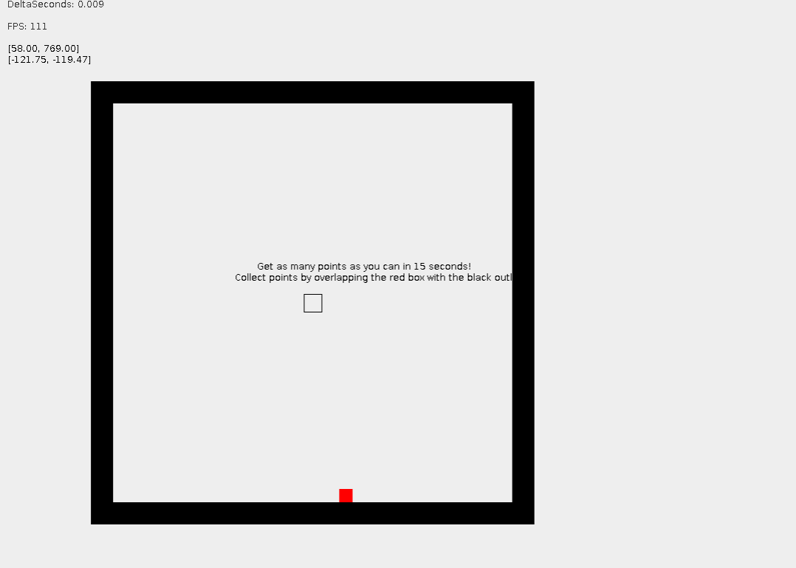

# APCS-Final
My final project for AP Computer Science at Wheaton North High School.

I started with the goal to make a physics-based 2D game and ended up having so much fun creating the physics engine that I forgot all about the game part.

Language: Java

Framework used (graphics): Swing

